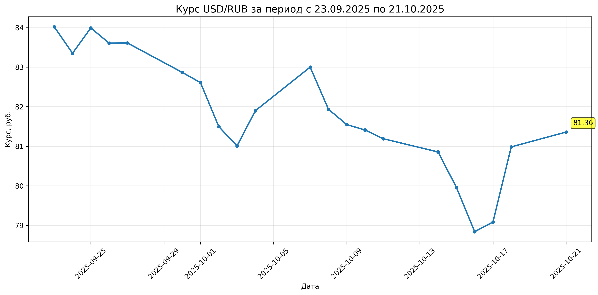
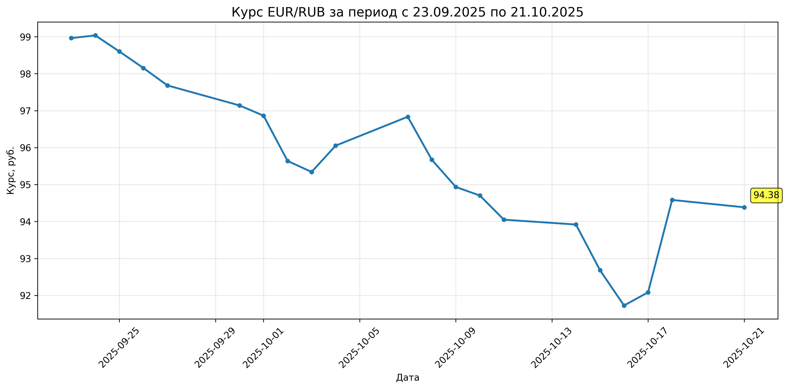

# Парсер курсов валют ЦБ РФ с визуализацией

Проект для парсинга и визуализации исторических данных о курсах валют с официального API Центрального Банка РФ.

## Возможности

- 📊 Получение исторических данных курсов валют
- 📈 Визуализация данных с помощью matplotlib
- 📅 Гибкая настройка периода анализа
- 💾 Сохранение графиков и данных в файлы
- 🔍 Статистический анализ данных

## Поддерживаемые валюты

- USD (доллар США) - R01235
- EUR (евро) - R01239
- GBP (фунт стерлингов) - R01035
- CNY (китайский юань) - R01375

## Примеры выходных данных
### График USD/RUB


### График EUR/RUB  


## Установка

1. Клонируйте репозиторий:
```bash
git clone https://github.com/Flufer/Currency-parser.git
cd Currency-parser
